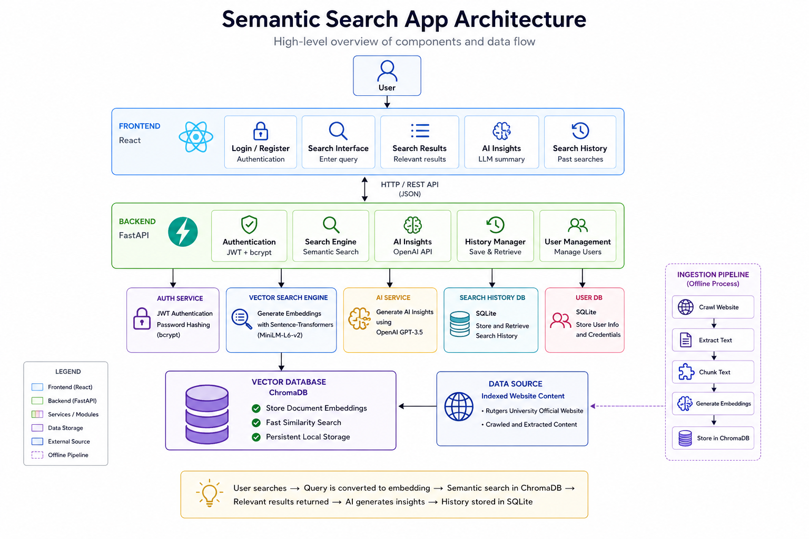
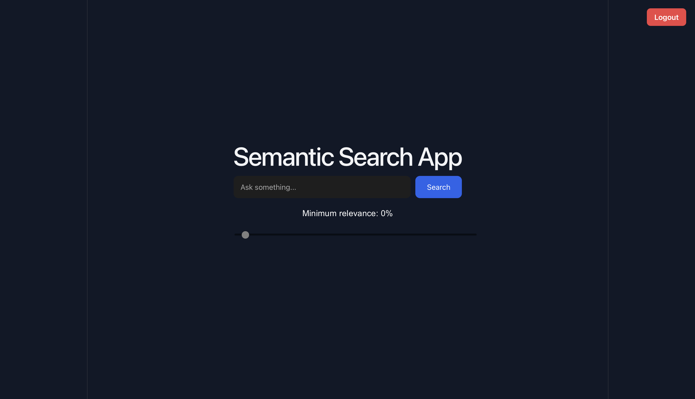
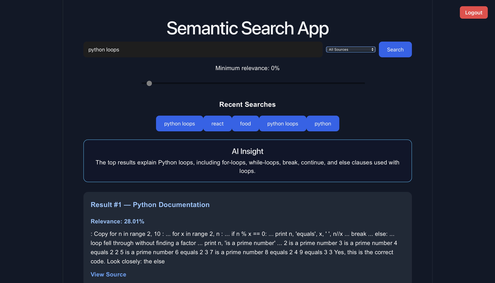

# Semantic Search App

A full-stack AI-powered semantic search engine that crawls website content, generates embeddings, stores vectors in ChromaDB, and returns contextually relevant search results with AI-generated insights.

---

## Features

- Website crawling and ingestion using Firecrawl
- Semantic search using Sentence Transformers embeddings
- Vector storage and retrieval with ChromaDB
- AI-generated insights from top search results
- User authentication using JWT
- Secure password hashing with bcrypt
- Search history persistence using SQLite
- Recent search suggestions
- Source filtering
- Relevance score filtering
- User login/logout functionality
- Responsive React frontend

---
## Architecture Diagram



---
## Tech Stack

| Layer | Technologies |
|--------|--------------|
| Frontend | React, JavaScript, CSS |
| Backend | FastAPI, Python |
| Vector Database | ChromaDB |
| Embeddings | Sentence Transformers (all-MiniLM-L6-v2) |
| Authentication | JWT, bcrypt |
| Database | SQLite |
| Web Crawling | Firecrawl |
| AI Features | LLM-powered Insights |

---

## Project Architecture

```text
User
  ↓
React Frontend
  ↓
FastAPI Backend
  ↓
Authentication Layer (JWT)
  ↓
Semantic Search Engine
  ↓
Sentence Transformer Embeddings
  ↓
ChromaDB Vector Database
  ↓
Website Content / Documents
```

---

## Application Workflow

1. User registers and logs in.
2. JWT token is generated and stored locally.
3. User submits a search query.
4. Query is converted into embeddings.
5. ChromaDB performs semantic similarity search.
6. Relevant results are returned.
7. Top snippets are summarized into AI insights.
8. Search history is stored in SQLite.

---

## Installation

### Clone Repository

```bash
git clone https://github.com/ninadshukla/semantic-search-app.git
cd semantic-search-app
```

### Backend Setup

```bash
cd backend
pip install -r requirements.txt
uvicorn main:app --reload
```

Backend runs on:

```text
http://127.0.0.1:8000
```

### Frontend Setup

```bash
cd frontend
npm install
npm run dev
```

Frontend runs on:

```text
http://localhost:5173
```

---

## Screenshots

### Login Page


### Search Interface



### Search Results


---

## Future Improvements

- Search analytics dashboard
- Bookmark favorite results
- Search autocomplete suggestions
- Theme toggle (Dark/Light mode)
- Export search history
- Advanced filtering

---

## What I Learned

Through this project I learned:

- Full-stack application development
- Building REST APIs with FastAPI
- JWT authentication and authorization
- Vector databases and semantic search
- React state management
- Database design with SQLite
- Error handling and integration testing
- AI application architecture

---

## Author

**Ninad Shukla**

Rutgers University – Newark

Software Engineering & AI Enthusiast